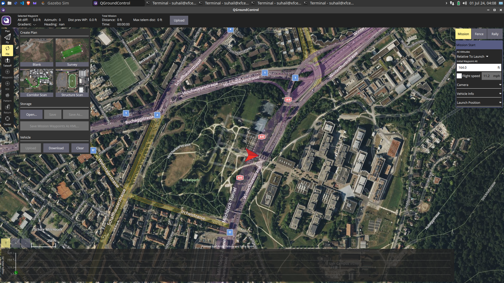

# Installing PX4 on ROS2 (Resolving ninja: error: unknown target 'gz_x500')

This readme provides to set the correct instructions to get going with PX4 with ROS2 Humble with Gazebo Garden and QGroundControl your machine.

This readme also assumes you have Ubuntu 22.04 LTS installed on your machine.

The installation script given in the PX4 Autopilot Documentation may lead you to the issue

    ninja: error: unknown target 'gz_x500'
    make: *** [Makefile:232: px4_sitl] Error 1

This occurs due to the installation script `PX4-Autopilot/Tools/setup/ubuntu.sh` being outdated as it installs Gazebo Fortress.

Following are the set of instructions to install Gazebo Garden, ROS2 Humble and QGroundControl.

## Install Gazebo Garden (Binary Installation on Ubuntu)
Garden binaries are provided for Ubuntu Focal and Jammy. The Garden binaries are hosted in the <packages.osrfoundation.org> repository. To install all of them, the metapackage `gz-garden` can be installed.

First install some necessary tools.

    sudo apt-get update 
    sudo apt-get install lsb-release wget gnupg

Then install Gazebo Garden.

    sudo wget https://packages.osrfoundation.org/gazebo.gpg -O /usr/share/keyrings/pkgs-osrf-archive-keyring.gpg 
    echo "deb [arch=$(dpkg --print-architecture) signed-by=/usr/share/keyrings/pkgs-osrf-archive-keyring.gpg] http://packages.osrfoundation.org/gazebo/ubuntu-stable $(lsb_release -cs) main" | sudo tee /etc/apt/sources.list.d/gazebo-stable.list > /dev/null 

All libraries should be ready to use and the `gz sim` app ready to be executed.

## Install PX4 Autopilot (Without The Simulator)
You need to install the PX4 development toolchain in order to use the simulator.

The `--no-sim-tools` flag will ignore the simulator in the `PX4-Autopilot/Tools/setup/ubuntu.sh` script and thus we can use the previously installed  `Gazebo Garden`.

    cd 
    git clone https://github.com/PX4/PX4-Autopilot.git --recursive 
    bash ./PX4-Autopilot/Tools/setup/ubuntu.sh  --no-sim-tools 
    cd PX4-Autopilot/ 
    make px4_sitl 

## Install ROS2 Humble
To install ROS 2 and its dependencies.

    sudo apt update && sudo apt install locales 
    sudo locale-gen en_US en_US.UTF-8 
    sudo update-locale LC_ALL=en_US.UTF-8 LANG=en_US.UTF-8 
    export LANG=en_US.UTF-8 
    sudo apt install software-properties-common 
    sudo add-apt-repository universe 
    sudo apt update && sudo apt install curl -y 
    sudo curl -sSL https://raw.githubusercontent.com/ros/rosdistro/master/ros.key -o /usr/share/keyrings/ros-archive-keyring.gpg 
    echo "deb [arch=$(dpkg --print-architecture) signed-by=/usr/share/keyrings/ros-archive-keyring.gpg] http://packages.ros.org/ros2/ubuntu $(. /etc/os-release && echo $UBUNTU_CODENAME) main" | sudo tee /etc/apt/sources.list.d/ros2.list > /dev/null 
    sudo apt update && sudo apt upgrade -y 
    sudo aptitude install ros-humble-desktop 
    sudo apt install ros-dev-tools 
    source /opt/ros/humble/setup.bash && echo "source /opt/ros/humble/setup.bash" >> .bashrc 

Some Python dependencies must also be installed (using `pip` or `apt`).

    pip install --user -U empy==3.3.4 pyros-genmsg setuptools

## Setup Micro XRCE-DDS Agent & Client
For ROS 2 to communicate with PX4, uXRCE-DDS client must be running on PX4, connected to a Micro XRCE-DDS agent running on the companion computer.

The agent can be installed onto the companion computer in a number of ways. Below is how to build the agent "standalone" from source and connect to a client running on the PX4 simulator.

To setup and start the agent:

Open a terminal. 

Enter the following commands to fetch and build the agent from source.

    cd 
    git clone https://github.com/eProsima/Micro-XRCE-DDS-Agent.git 
    cd Micro-XRCE-DDS-Agent 
    mkdir build 
    cd build 
    cmake .. 
    make 
    sudo make install 
    sudo ldconfig /usr/local/lib/ 

## Download QGroundControl
    cd
    sudo usermod -a -G dialout $USER 
    sudo apt-get remove modemmanager -y 
    sudo apt install gstreamer1.0-plugins-bad gstreamer1.0-libav gstreamer1.0-gl -y 
    sudo apt install libqt5gui5 -y 
    sudo apt install libfuse2 -y 
    sudo apt install wget -y 
    wget https://d176tv9ibo4jno.cloudfront.net/latest/QGroundControl.AppImage -P ~/
    chmod +x QGroundControl.AppImage

## Run The Micro XRCE Agent
Start the Micro XRCE-DDS Agent with settings for connecting to the Micro XRCE-DDS Client running on the simulator:

    MicroXRCEAgent udp4 -p 8888

The agent is now running, but you won't see much until we start PX4 (in the next step). You can leave the agent running in this terminal! Note that only one agent is allowed per connection channel.

## Start The Micro XRCE-DDS Client
The PX4 simulator starts the uXRCE-DDS client automatically, connecting to UDP port 8888 on the local host.

To start the simulator (and client):

Open a new terminal in the root of the PX4 Autopilot repo that was installed above.

    make px4_sitl gz_x500 

The PX4 terminal displays the `NuttShell/PX4` System Console output as PX4 boots and runs. 

Now run the QGroundControl in a new terminal.
    
    cd
    ./QGroundControl.AppImage

## Build ROS 2 Workspace
This section shows how create a ROS 2 workspace hosted in your home directory (modify the commands as needed to put the source code elsewhere).

The `px4_ros_com` and px4_msgs packages are cloned to a workspace folder, and then the colcon tool is used to build the workspace. The example is run using ros2 launch.

The example builds the ROS 2 Listener example application, located in `px4_ros_com`. `px4_msgs` is needed too so that the example can interpret PX4 ROS 2 topics.

## Building the Workspace
To create and build the workspace:

Open a new terminal. 
Create and navigate into a new workspace directory using:

    sh
    mkdir -p ~/ws_sensor_combined/src/
    cd ~/ws_sensor_combined/src/

A naming convention for workspace folders can make it easier to manage workspaces.

Clone the example repository and px4_msgs to the `/src` directory (the main branch is cloned by default, which corresponds to the version of PX4 we are running):

    git clone https://github.com/PX4/px4_msgs.git
    git clone https://github.com/PX4/px4_ros_com.git
    
Source the ROS 2 development environment into the current terminal and compile the workspace using colcon:

    cd ..
    source /opt/ros/humble/setup.bash
    colcon build

This builds all the folders under `/src` using the sourced toolchain.

## Running the Example
To run the executables that you just built, you need to source `local_setup.bash`. This provides access to the `environment hooks` for the current workspace. In other words, it makes the executables that were just built available in the current terminal.

The ROS2 beginner tutorials recommend that you open a new terminal for running your executables.

In a new terminal:

Navigate into the top level of your workspace directory and source the ROS 2 environment (in this case "Humble"):

    cd ~/ws_sensor_combined/
    source /opt/ros/humble/setup.bash

Source the local_setup.bash.

    source install/local_setup.bash

Now launch the example. Note here that we use `ros2 launch`, which is described below.

    ros2 launch px4_ros_com sensor_combined_listener.launch.py

If this is working you should see data being printed on the terminal/console where you launched the `ROS listener`.

    [INFO] [launch]: Default logging verbosity is set to INFO
    [INFO] [sensor_combined_listener-1]: process started with pid [3055]
    [sensor_combined_listener-1] Starting sensor_combined listener node...
    [sensor_combined_listener-1] RECEIVED SENSOR COMBINED DATA
    [sensor_combined_listener-1] =============================
    [sensor_combined_listener-1] ts: 1719784964841850
    [sensor_combined_listener-1] gyro_rad[0]: 0.000409249
    [sensor_combined_listener-1] gyro_rad[1]: -9.72393e-06
    [sensor_combined_listener-1] gyro_rad[2]: -8.82924e-05
    [sensor_combined_listener-1] gyro_integral_dt: 4000
    [sensor_combined_listener-1] accelerometer_timestamp_relative: 0
    [sensor_combined_listener-1] accelerometer_m_s2[0]: -0.0169444
    [sensor_combined_listener-1] accelerometer_m_s2[1]: 0.0165369
    [sensor_combined_listener-1] accelerometer_m_s2[2]: -9.80288
    [sensor_combined_listener-1] accelerometer_integral_dt: 4000

To see the active topics on a new terminal, run:
    ros2 topic list

The output will be like:

    /fmu/in/actuator_motors
    /fmu/in/actuator_servos
    /fmu/in/arming_check_reply
    /fmu/in/aux_global_position
    /fmu/in/config_control_setpoints
    /fmu/in/config_overrides_request
    /fmu/in/differential_drive_setpoint
    /fmu/in/goto_setpoint
    /fmu/in/manual_control_input
    /fmu/in/message_format_request
    /fmu/in/mode_completed
    /fmu/in/obstacle_distance
    /fmu/in/offboard_control_mode
    /fmu/in/onboard_computer_status
    /fmu/in/register_ext_component_request
    /fmu/in/sensor_optical_flow
    /fmu/in/telemetry_status
    /fmu/in/trajectory_setpoint
    /fmu/in/unregister_ext_component
    /fmu/in/vehicle_attitude_setpoint
    /fmu/in/vehicle_command
    /fmu/in/vehicle_command_mode_executor
    /fmu/in/vehicle_mocap_odometry
    /fmu/in/vehicle_rates_setpoint
    /fmu/in/vehicle_thrust_setpoint
    /fmu/in/vehicle_torque_setpoint
    /fmu/in/vehicle_trajectory_bezier
    /fmu/in/vehicle_trajectory_waypoint
    /fmu/in/vehicle_visual_odometry
    /fmu/out/battery_status
    /fmu/out/estimator_status_flags
    /fmu/out/failsafe_flags
    /fmu/out/manual_control_setpoint
    /fmu/out/position_setpoint_triplet
    /fmu/out/sensor_combined
    /fmu/out/timesync_status
    /fmu/out/vehicle_attitude
    /fmu/out/vehicle_control_mode
    /fmu/out/vehicle_global_position
    /fmu/out/vehicle_gps_position
    /fmu/out/vehicle_land_detected
    /fmu/out/vehicle_local_position
    /fmu/out/vehicle_odometry
    /fmu/out/vehicle_status
    /parameter_events
    /rosout

## Here is an image of the PX4 Standard VTOL Aircraft with QGroundControl on ROS2 Humble.

